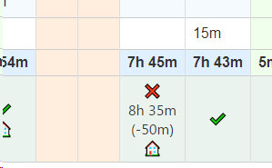

# jira_freee_working_time_checker

freee APIを用いてJIRAのTimesheet Reports and Gadgetsテーブルに、freeeから取得した勤務時間を表示します。

## スクリーンショット

## インストール

1. ブラウザ拡張機能の「[Tampermonkey](https://www.tampermonkey.net/)」をインストールします。
2. [freee API](https://developer.freee.co.jp)にアクセスし、開発者アカウントを取得します。
3. [スクリプト](./src/jira_freee_working_time_checker.user.js)をダウンロードします。
4. エディターでスクリプトを編集します。
   - ★★Jiraが動作しているアドレス★★の部分を、Jiraの動作しているアドレスに変更します。
   - ★★freee APIから取得する★★の部分を、freee APIから取得した値に変更します。
   - ★★勤怠メモに応じた絵文字テーブル（以下はdominosoftの例）★★の部分を、変換したい内容に変更します。
5. スクリプトをTampermonkeyに登録します。
